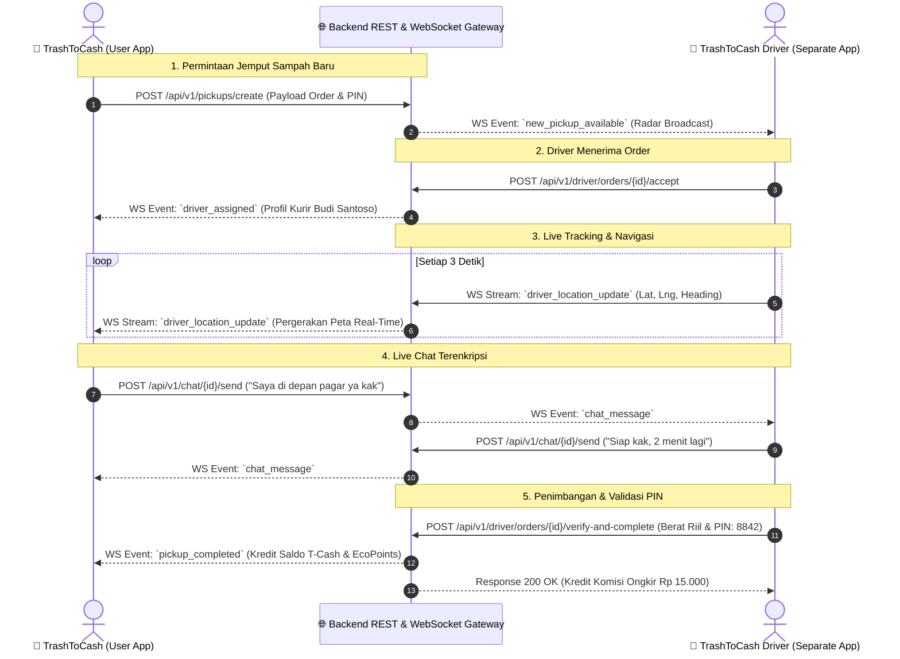

# 🔌 TrashToCash ⇄ TrashToCash Driver API & WebSocket Integration Contract

Dokumentasi ini adalah spesifikasi arsitektur integrasi resmi antara **Aplikasi Pengguna (TrashToCash)** dan **Aplikasi Driver Terpisah (TrashToCash Driver)** melalui REST API dan WebSocket Gateway.

---

## 🏗️ 1. Arsitektur Komunikasi Sistem



---

## 📡 2. REST API Endpoints

### Base URL:
- Production: `https://api.trashtocash.id/api/v1`
- Staging / Local: `http://localhost:8000/api/v1` (atau IP jaringan lokal)

---

### A. Endpoint untuk Aplikasi Pengguna (TrashToCash)

#### 1. Buat Permintaan Penjemputan Baru
- **Method**: `POST`
- **Path**: `/pickups/create`
- **Request Body**:
```json
{
  "transaction_id": "TRX-JMP-882190",
  "user_name": "Siti Rahmawati",
  "user_phone": "0812-3456-7890",
  "waste_name": "Plastik PET (Botol Bening)",
  "waste_type": "Non-Organik",
  "weight_kg": 4.5,
  "rate_per_kg": 10.0,
  "total_reward": 45.0,
  "pickup_address": "Jl. Melati Blok C2 No. 15, Jakarta Selatan",
  "pickup_date": "Hari Ini (27 Agu)",
  "pickup_time": "14:00 (Siang)",
  "pickup_notes": "Taruh di teras dekat pagar",
  "handover_pin": "8842"
}
```
- **Response `201 Created`**:
```json
{
  "success": true,
  "status": "order_broadcasted_to_drivers",
  "transaction_id": "TRX-JMP-882190",
  "message": "Pesanan penjemputan berhasil dibuat dan disiarkan ke kurir terdekat."
}
```

---

#### 2. Cek Status Penjemputan
- **Method**: `GET`
- **Path**: `/pickups/{transaction_id}/status`
- **Response `200 OK`**:
```json
{
  "transaction_id": "TRX-JMP-882190",
  "status": "heading_to_user", // 'searching', 'assigned', 'heading_to_user', 'arrived', 'completed'
  "driver": {
    "driver_id": "T2C-8842",
    "name": "Budi Santoso",
    "phone": "+62 812-3456-7890",
    "vehicle_plate": "B 1234 XYZ",
    "vehicle_type": "Motor Listrik Eco",
    "rating": 4.9,
    "avatar_url": "https://images.unsplash.com/photo-1507003211169-0a1dd7228f2d"
  },
  "eta": "6 Menit",
  "distance_km": 1.2
}
```

---

### B. Endpoint untuk Aplikasi Driver (TrashToCash Driver)

#### 1. Radar Orderan Masuk di Sekitar Kurir
- **Method**: `GET`
- **Path**: `/driver/orders/radar?lat=-6.2088&lng=106.8456&radius_km=5.0`
- **Response `200 OK`**:
```json
{
  "available_orders": [
    {
      "transaction_id": "TRX-JMP-882190",
      "user_name": "Siti Rahmawati",
      "user_address": "Jl. Melati Blok C2 No. 15",
      "distance_km": 1.2,
      "waste_name": "Plastik PET",
      "estimated_weight_kg": 4.5,
      "delivery_fee": 15000.0,
      "pickup_time": "14:00"
    }
  ]
}
```

#### 2. Driver Menerima Pesanan
- **Method**: `POST`
- **Path**: `/driver/orders/{transaction_id}/accept`
- **Request Body**:
```json
{
  "driver_id": "T2C-8842"
}
```

#### 3. Update Status Tahapan oleh Driver
- **Method**: `POST`
- **Path**: `/driver/orders/{transaction_id}/update-status`
- **Request Body**:
```json
{
  "status": "arrived_at_location" // 'heading_to_user', 'arrived_at_location'
}
```

#### 4. Update Koordinat GPS Real-Time oleh Driver (REST API)
- **Method**: `POST`
- **Path**: `/driver/location/update`
- **Request Body**:
```json
{
  "transaction_id": "TRX-JMP-882190",
  "latitude": -6.2086,
  "longitude": 106.8458,
  "speed_kmph": 32.0,
  "heading": 42.0,
  "distance_km": 0.8,
  "eta": "4 Menit",
  "progress": 0.35,
  "timestamp": "2026-08-27T01:50:00Z"
}
```
- **Response `200 OK`**:
```json
{
  "success": true,
  "message": "Koordinat GPS kurir berhasil diperbarui dan disiarkan ke pengguna."
}
```

#### 5. Selesaikan Penjemputan & Verifikasi PIN
- **Method**: `POST`
- **Path**: `/driver/orders/{transaction_id}/verify-and-complete`
- **Request Body**:
```json
{
  "driver_id": "T2C-8842",
  "actual_weight_kg": 4.8,
  "entered_pin": "8842",
  "proof_photo_url": "https://storage.trashtocash.id/proofs/trx882190.jpg"
}
```

---

## ⚡ 3. WebSocket Real-Time Event Protocol

WebSocket Endpoint: `wss://api.trashtocash.id/ws/orders/{transaction_id}`

### Event Format:
```json
{
  "event": "driver_location_update",
  "transaction_id": "TRX-JMP-882190",
  "data": {
    "latitude": -6.2086,
    "longitude": 106.8458,
    "heading": 42.0,
    "speed": 28.5,
    "eta": "5 Menit"
  }
}
```

---

## 📱 4. Deep Link & App-to-App Scheme

- **Skema Buka Aplikasi Driver**:
  `trashtocash-driver://order/{transaction_id}?pin={handover_pin}`
- **Skema Buka Aplikasi Warga**:
  `trashtocash://order/{transaction_id}`
- **Package Android Driver**: `com.trashtocash.driver`
